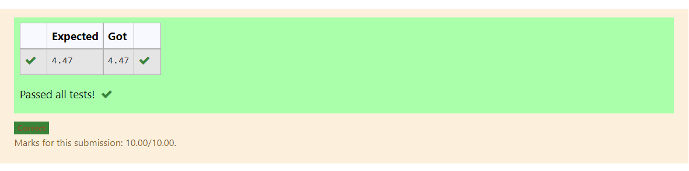

# DISTANCE-BETWEEN-TWO-POINTS

## AIM:
To write a python program to find the distance two 2 points
ALGORITHM:
Step 1:
Get 4 inputs from the user.

Step 2:
Classify with x1,x2 and y1,y2 points.

Step 3
Import math module.

Step 4:
Substitute the values in the distance formula.formula

Step 5:
Display the output using format function.
### PROGRAM:
```
#Program to find the distance between two points.
#Developed by: Virgil Jovita A
#RegisterNumber:21500600
import math
x=[10,6]
y=[4,2]
dist=math.sqrt((2-4)**2+(6-10)**2)
print("{:.2f}".format(dist))
```


### OUTPUT:
.png)


### RESULT:
Thus, The distance two 2 points

